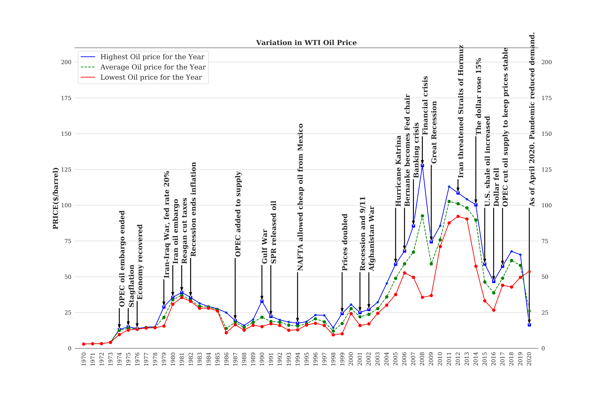
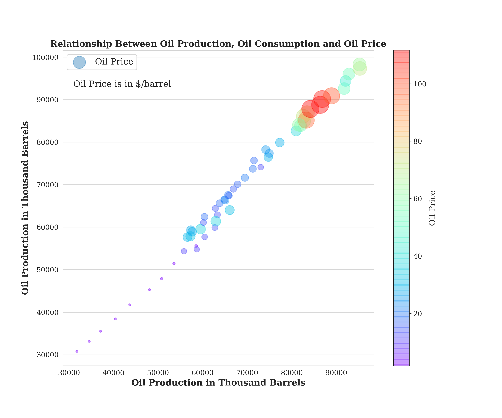
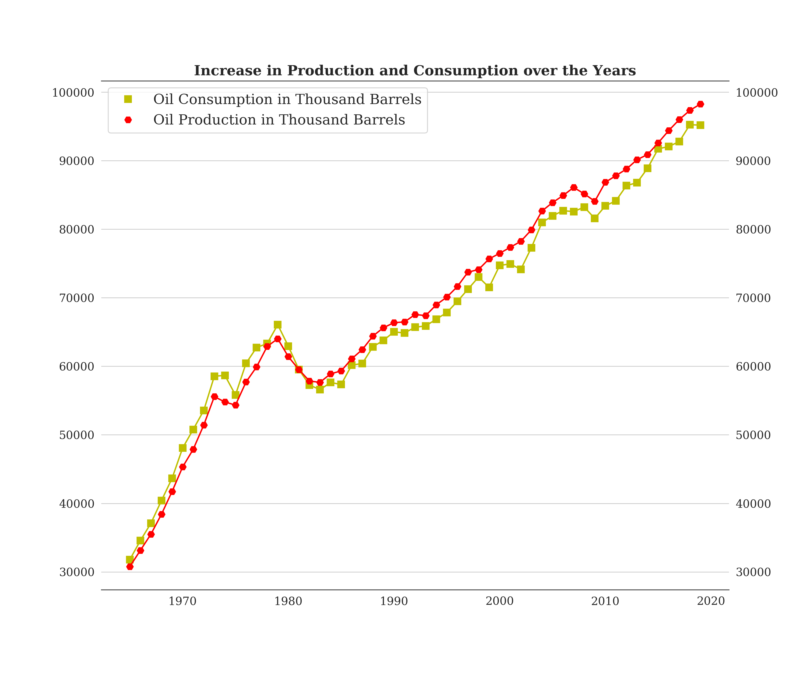
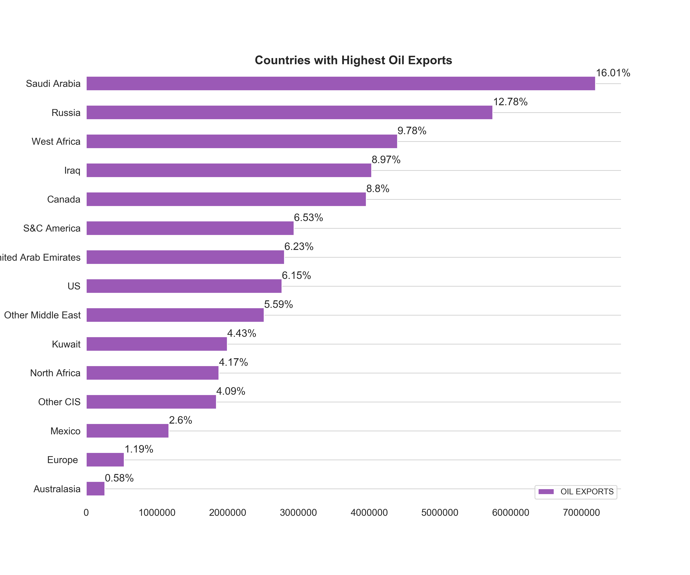
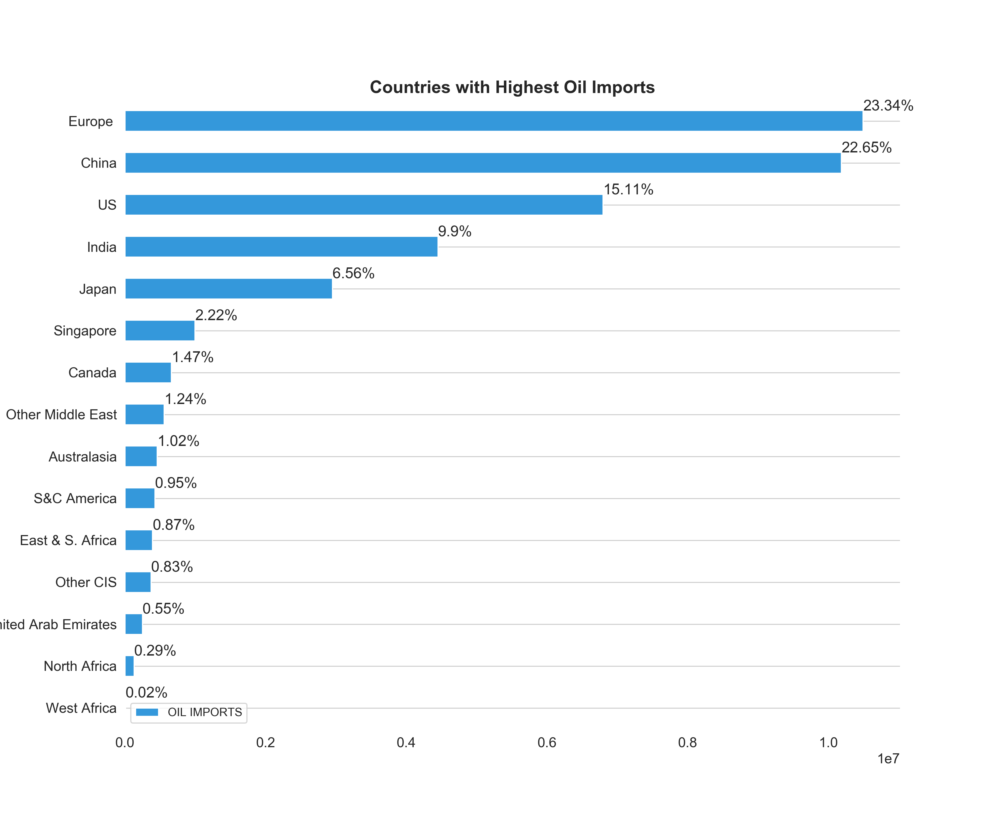
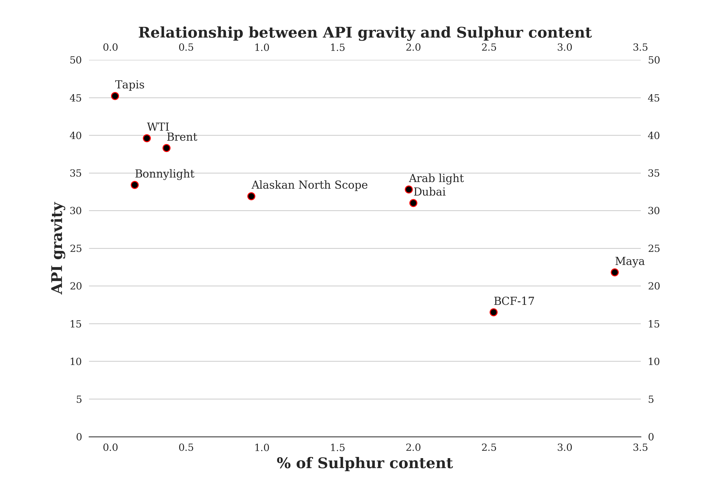
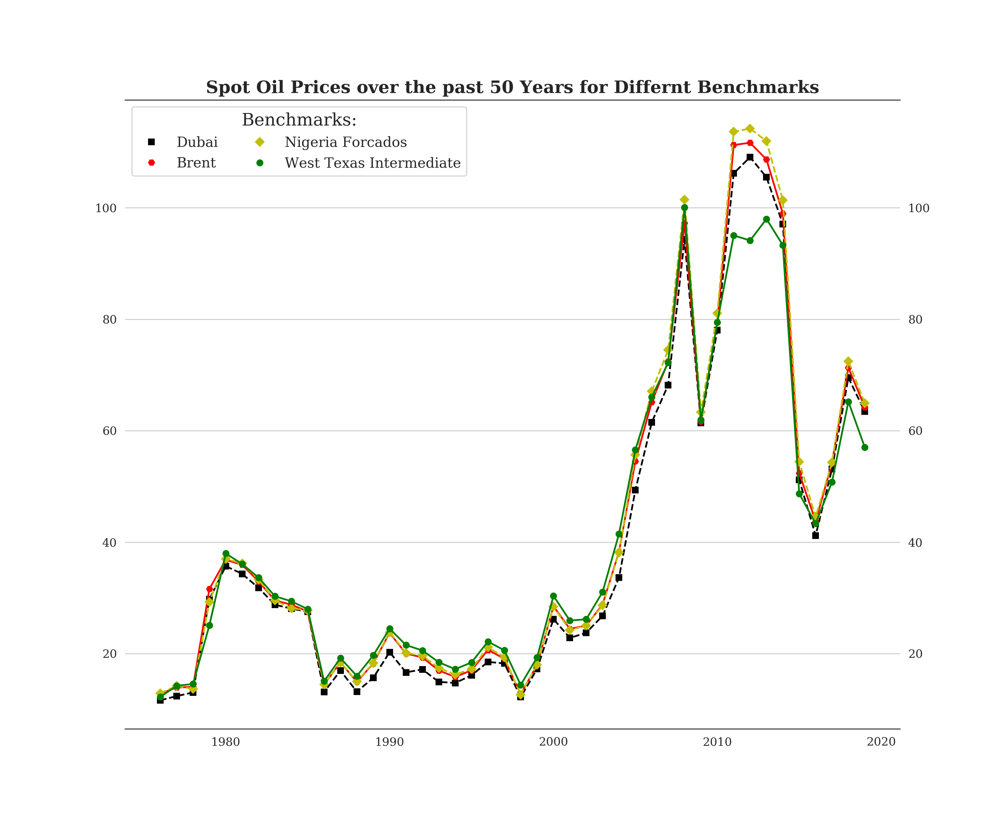

# Understanding Oil Price CHARTS

This contains the code used to plot all diagrams used in the ` Understanding Oil Price Section` of the Energy Review.

Python programming language was used for the entire project

## Getting Started

```
First of all download and copy the `.py` and all the `excel` or `csv` files to a folder of your choice.
#OR
Clone the git repo and run directly.
```
Make sure you have the following modules installed:
```
pandas
numpy
matplotlib
datetime
seaborn
```

## About the file

The File produces charts relating to oil production, oil consumption, gas production, gas consumption, oil price statistics, and a general overview of the energy industry.

The source of the data is BP Statistical Review 2020

## Screenshots

The following are some of the charts that can be generated:















